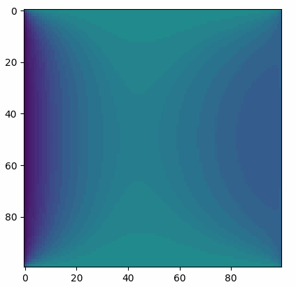
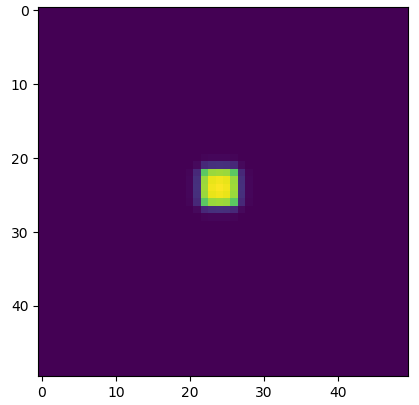

Transient Heat Condiction Problem
=================================

.. math::  \frac{\partial \rho T}{\partial t} = \frac{\partial}{\partial x} (\frac{k}{c_p} \frac{\partial T}{\partial x}) 

Considering the Finite Volume Method (FVM), the unidimensional equation
will be solved for T by integrating both sides over a control volume
(from a face in position :math:`x` to a face in the position
:math:`x+dx`) and over time (from time :math:`t` to :math:`t+dt`), as in

.. math::  \int_{x}^{x+\Delta x} \int_{t}^{t+\Delta t} \frac{\partial \rho T}{\partial t} dt\ dx = \int_{x}^{x+\Delta x} \int_{t}^{t+\Delta t} \frac{\partial}{\partial x} (\frac{k}{c_p} \frac{\partial T}{\partial x}) dt\ dx

Imagining an 1D domain, represented using several control volume
elements (As shown below), then :math:`x` = :math:`T_w`, and
:math:`x+\Delta x` = :math:`T_e` (That is, the property available at the
domain's limits, not their centers).

This results in

.. math::  \int_{w}^{e} (\rho T_P - \rho T_P^o) dx = \int_{t}^{t+\Delta t} \frac{k}{c_p} \frac{\partial T}{\partial x}\bigg\rvert_e - \frac{k}{c_p} \frac{\partial T}{\partial x}\bigg\rvert_w dt

Let now assume that tha property is constant over :math:`T_X` from face
:math:`T_w` to face :math:`T_e`. Let's also not specify the behavior of
the integral of the properties on the right side of the equation,
letting :math:`\theta` be a variable that will specify it later (As done
in [1]). This leads to the following equation:

.. math::  (\rho T_P - \rho T_P^o)\Delta x = (\frac{k}{c_p} \frac{\partial T}{\partial x}\bigg\rvert_e^\theta - \frac{k}{c_p} \frac{\partial T}{\partial x}\bigg\rvert_w^\theta)\Delta t

To approximate the values of the derivative of :math:`T` over the faces
:math:`T_w` and :math:`T_e`, it'll be used a common central differences
approach, that is

.. math:: \frac{\Delta F}{\Delta x} = \frac{F(x + \Delta x) - F(x - \Delta x)}{\Delta x}

Remember, again, that :math:`F(x-\Delta x) = F_w` and
:math:`F(x+\Delta x) = F_e`, then

.. math::  (\rho T_P - \rho T_P^o)\Delta x = (\frac{k}{c_p} \frac{T_E^\theta - T_P^\theta}{\Delta x} - \frac{k}{c_p} \frac{T_P^\theta - T_W^\theta}{\Delta x})\Delta t

Where :math:`T^\theta = \theta T + (1 - \theta) T^o`

Explicit Formulation
--------------------

For the explicit case, :math:`\theta = 0`, and the equation will be
simply :math:`T_P = f(T_P^o, T_W^o, T_E^o)`, as shown bellow:

.. math::  (\rho T_P - \rho T_P^o)\Delta x = (\frac{k}{c_p} \frac{T_E^o - T_P^o}{\Delta x} - \frac{k}{c_p} \frac{T_P^o - T_W^o}{\Delta x})\Delta t

So, :math:`T_P` is the only unknown variable at this point. For the case
of the first timestep, :math:`T_P^o`, :math:`T_E^o` and :math:`T_W^o`
must be known. Also, for the boundaries, values for :math:`T_E` and
:math:`T_W` must be specified. This leads to the following equation:

.. math:: \frac{\rho \Delta x}{\Delta t} T_P = \frac{k}{c_p \Delta x} T_E^o - 2\frac{k}{c_p \Delta x} T_P^o + \frac{k}{c_p \Delta x} T_W^o + \frac{\rho \Delta x}{\Delta t} T_P^o

Fully Implicit Formulation
--------------------------

For the fully implicit formulation, :math:`\theta = 1`, and thus:

.. math::  (\rho T_P - \rho T_P^o)\Delta x = (\frac{k}{c_p} \frac{T_E - T_P}{\Delta x} - \frac{k}{c_p} \frac{T_P - T_W}{\Delta x})\Delta t

And then, :math:`T_P` appears on both sides of the equation. There are
also more unknowns (:math:`T_E` and :math:`T_W`) in each cell equation.
This means that this approach needs to be solved with a linear solver.
It is desired to have something with the structure of a linear equation,
with the following format:

.. math:: [A][X] = [B]

Where :math:`[A]` and :math:`[B]` are matrices with :math:`n_x` x
:math:`n_x` elements (Mesh size). Each line in :math:`[A]` correspond to
the coefs of the linear equation.

Because of that, each coeficient for A is separated, as in the explicit
formulation:

.. math:: \frac{\rho \Delta x}{\Delta t} T_P = \frac{k}{c_p \Delta x} T_E - 2\frac{k}{c_p \Delta x} T_P + \frac{k}{c_p \Delta x} T_W + \frac{\rho \Delta x}{\Delta t} T_P^o

But for this case, the unknowns will be in the left side of the
equation, and the knowns in the right side, to form the matrix
:math:`[B]`:

.. math:: \frac{\rho \Delta x}{\Delta t} T_P - \frac{k}{c_p \Delta x} T_E + 2\frac{k}{c_p \Delta x} T_P - \frac{k}{c_p \Delta x} T_W = \frac{\rho \Delta x}{\Delta t} T_P^o

.. math:: (2\frac{k}{c_p \Delta x} + \frac{\rho \Delta x}{\Delta t}) T_P - \frac{k}{c_p \Delta x} T_E - \frac{k}{c_p \Delta x} T_W = \frac{\rho \Delta x}{\Delta t} T_P^o

It is imporant to notice that the structure of the matrix :math:`[A]` in
this case will be a banded (tridiagonal) matrix. Because of that, it is
possible to separate each coeficient in the above equation, such that
it'll be easy to build such matrix:

.. math:: A_P*T_P = A_E*T_E + A_W*T_W + B_P

.. math:: A_P = (2\frac{k}{c_p \Delta x} + \frac{\rho \Delta x}{\Delta t})

.. math:: A_E = A_W = \frac{k}{c_p \Delta x}

.. math:: B_P = \frac{\rho \Delta x}{\Delta t} T_P^o

For this problem, it is assumed that :math:`T_E` and :math:`T_W` are
known at the boundaries (To simplify the final implementation's
version), that is, there are ghost nodes with a pre-defined solution at
the boundary of the domain. Since we know the solution for those nodes,
they'll not be solved.

Bidimensional problem
---------------------

In order to extend the solution for the 2D problem, it is necessary to
go back to the original problem and extend it accordingly:

.. math::  \frac{\partial \rho T}{\partial t} = \frac{\partial}{\partial x} (\frac{k}{c_p} \frac{\partial T}{\partial x}) + \frac{\partial}{\partial y} (\frac{k}{c_p} \frac{\partial T}{\partial y}) 

For this, it is easy to see that it is possible to, again, integrate the
whole equation over time and space, aplying the FVM. This will lead to
something similar to the equation below.

.. math::  \int_{x}^{x+\Delta x} \int_{y}^{y+\Delta y} \int_{t}^{t+\Delta t} (...) dt\ dx = \int_{x}^{x+\Delta x} \int_{y}^{y+\Delta y} \int_{t}^{t+\Delta t} (...) dt\ dx + \int_{x}^{x+\Delta x} \int_{y}^{y+\Delta y} \int_{t}^{t+\Delta t} \frac{\partial}{\partial y} (\frac{k}{c_p} \frac{\partial T}{\partial y}) dt\ dy

In fact, the problem didn't changed that much, and it is easy to make
again similar steps for this case (At this point, already assuming the
fully implicit formulation):

.. math::  (\rho T_P - \rho T_P^o)\Delta x \Delta y = (\frac{k}{c_p} \frac{T_E - T_P}{\Delta x} - \frac{k}{c_p} \frac{T_P - T_W}{\Delta x}) \Delta y \Delta t + (\frac{k}{c_p} \frac{T_N - T_P}{\Delta y} - \frac{k}{c_p} \frac{T_P - T_S}{\Delta y})  \Delta x \Delta t

.. math:: \frac{\rho \Delta x \Delta y}{\Delta t} T_P = \frac{k \Delta y}{c_p \Delta x} T_E - 2\frac{k \Delta y}{c_p \Delta x} T_P + \frac{k \Delta y}{c_p \Delta x} T_W + \frac{k \Delta x}{c_p \Delta y} T_N - 2\frac{k \Delta x}{c_p \Delta y} T_P + \frac{k \Delta x}{c_p \Delta y} T_S + \frac{\rho \Delta x \Delta y}{\Delta t} T_P^o

.. math:: \frac{\rho \Delta x \Delta y}{\Delta t} T_P + 2\frac{k \Delta y}{c_p \Delta x} T_P + 2\frac{k \Delta x}{c_p \Delta y} T_P = \frac{k \Delta y}{c_p \Delta x} T_E + \frac{k \Delta y}{c_p \Delta x} T_W + \frac{k \Delta x}{c_p \Delta y} T_N + \frac{k \Delta x}{c_p \Delta y} T_S + \frac{\rho \Delta x \Delta y}{\Delta t} T_P^o

.. math:: (\frac{\rho \Delta x \Delta y}{\Delta t} + 2\frac{k \Delta y}{c_p \Delta x} + 2\frac{k \Delta x}{c_p \Delta y}) T_P = \frac{k \Delta y}{c_p \Delta x} T_E + \frac{k \Delta y}{c_p \Delta x} T_W + \frac{k \Delta x}{c_p \Delta y} T_N + \frac{k \Delta x}{c_p \Delta y} T_S + \frac{\rho \Delta x \Delta y}{\Delta t} T_P^o

Where it is easy to retrieve :math:`A_P`, :math:`A_E`, :math:`A_W`,
:math:`A_N`, :math:`A_S` and :math:`B_P`.

Results from first implementation
---------------------------------

As a first problem, the left and right boundary ghost node elements have
been prescribed with functions derived from :math:`sin(t)` and
:math:`cos(t)`. The result is shown below in gif format. This result can
be obtained with git tag: ``v1.0.0``

Residual-based equations
~~~~~~~~~~~~~~~~~~~~~~~~

Although the problem can be solved using the previous approach of
gathering common terms (:math:`A_P`, :math:`A_E`, :math:`A_W`, etc.),
there is other way of organizing the terms that may be more interesting
because it makes it easier to add more terms and to calculate some
conditions (Such as prescribed flow in the boundaries).

Stepping back to our 1D problem, we had that

.. math::  (\rho T_P - \rho T_P^o)\Delta x = (\frac{k}{c_p} \frac{T_E - T_P}{\Delta x} - \frac{k}{c_p} \frac{T_P - T_W}{\Delta x})\Delta t

Because the only term that will not carry the :math:`\Delta t` is the
left-side term, it is common to divide all terms by :math:`\Delta t` so
that to simplify a little the equation. Also, we move all terms to the
left side:

.. math::  (\rho T_P - \rho T_P^o)\frac{\Delta x}{\Delta t} - (\frac{k}{c_p} \frac{T_E - T_P}{\Delta x} - \frac{k}{c_p} \frac{T_P - T_W}{\Delta x}) = 0

This can be used as a residual equation, with :math:`T_W`, :math:`T_E`
and :math:`T_P` unknowns.

It is common to call the left-side of the equation the "Transient term"
or "Accumulation term":

.. math:: (\rho T_P - \rho T_P^o)\frac{\Delta x}{\Delta t}

The other two terms are the called "Flux terms". Because they come from
a second order differential equation, they are also known as "Diffusive
flux terms":

.. math:: \frac{k}{c_p} \frac{T_E - T_P}{\Delta x}

.. math:: \frac{k}{c_p} \frac{T_P - T_W}{\Delta x}

Note that for the boundaries, it is easier to define the diffusive flux
terms for the case where we have prescribed :math:`T` at the boundaries.
Basically, what is done is the exactly the same approximation, but with
a closer term. For example, for the left-side boundary condition, the
flux term can be written as

.. math:: \frac{k}{c_p} \frac{T_P - T_w}{\Delta x / 2}

Note that :math:`T_w` (lowercase :math:`w`) represents the property
:math:`T` at the west **face** of the control volume. That's why
:math:`\Delta x` is divided by two (Assuming equally-spaced cartesian
mesh).

Other possible boundary condition would by a prescribed flow (Usually
called :math:`q''` or :math:`q'''`). In this case, the value is fully
used at the boundary, and no further equation is necessary.

This idea extends easily to the 2D model, as shown below:

.. math::  (\rho T_P - \rho T_P^o)\Delta x \Delta y = (\frac{k}{c_p} \frac{T_E - T_P}{\Delta x} - \frac{k}{c_p} \frac{T_P - T_W}{\Delta x}) \Delta y \Delta t + (\frac{k}{c_p}\frac{T_N - T_P}{\Delta y} - \frac{k}{c_p} \frac{T_P - T_S}{\Delta y})  \Delta x \Delta t

.. math::  (\rho T_P - \rho T_P^o)\frac{\Delta x \Delta y}{\Delta t} = (\frac{k}{c_p} \frac{T_E - T_P}{\Delta x} - \frac{k}{c_p} \frac{T_P - T_W}{\Delta x}) \Delta y + (\frac{k}{c_p} \frac{T_N - T_P}{\Delta y} - \frac{k}{c_p} \frac{T_P - T_S}{\Delta y})  \Delta x

Observing diffusion phenomena
~~~~~~~~~~~~~~~~~~~~~~~~~~~~~

By setting the boundary conditions with zero flux terms, and the initial
condition having an high-temperature spot at it's center, it is possible
to observe it gradually expanding with the diffusion. This result can be
viewed on ``v1.1.0`` tag.

Source Term
~~~~~~~~~~~

A possible step further in our model is to add a source term in the
equation. The source term is a function :math:`S` that can create
temperature in the system at time :math:`t`, and position :math:`(x,y)`.

.. math::  \frac{\partial \rho T}{\partial t} + S(x, y, t) = \frac{\partial}{\partial x} (\frac{k}{c_p} \frac{\partial T}{\partial x}) 

After applying the discretization in the new term, the equation will
give:

:raw-latex:`\int`\_{t}^{t+:raw-latex:`\Delta `t}

Bibliografy
===========

[1] MALISKA, C. R. - Transferência de Calor e Mecânica dos Fluidos
Computacional, 2a Edição
